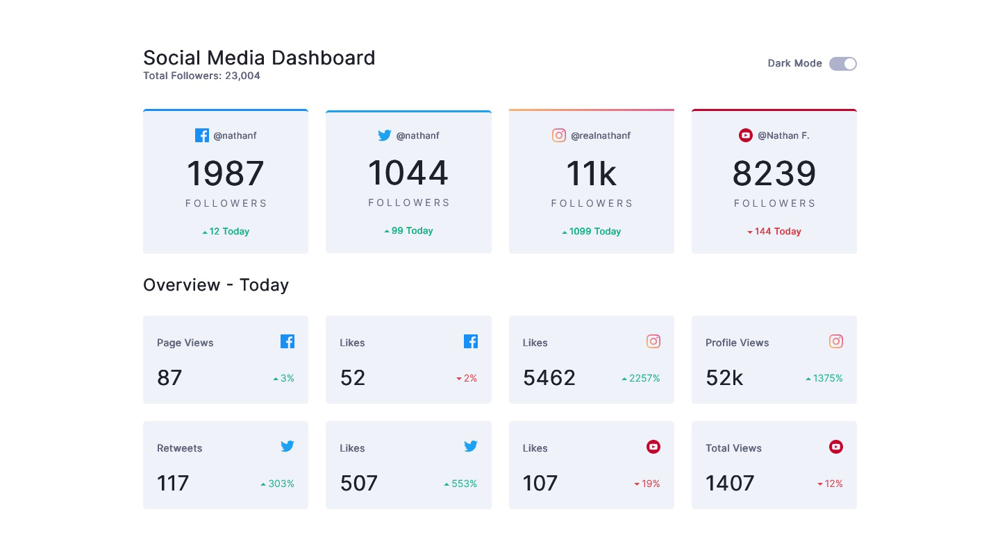

# Frontend Mentor - Social media dashboard with theme switcher solution

This is a solution to the [Social media dashboard with theme switcher challenge on Frontend Mentor](https://www.frontendmentor.io/challenges/social-media-dashboard-with-theme-switcher-6oY8ozp_H). Frontend Mentor challenges help you improve your coding skills by building realistic projects. 

## Table of contents

- [Overview](#overview)
  - [The challenge](#the-challenge)
  - [Screenshots](#screenshots)
  - [Links](#links)
- [My process](#my-process)
  - [Built with](#built-with)
  - [What I learned](#what-i-learned)
  - [Continued development](#continued-development)
  - [Useful resources](#useful-resources)
- [Author](#author)

## Overview

### The challenge

Users should be able to:

- View the optimal layout for the site depending on their device's screen size
- See hover states for all interactive elements on the page
- Toggle color theme to their preference

### Screenshots



[(Mobile screenshot too long to show here)](./screenshot_mobile.jpg) 


### Links

- Solution URL: [Source code](https://github.com/theGamingKitten/social-media-dashboard-with-theme-switcher-master)
- Live Site URL: [Preview](https://social-media-dashboard-with-theme-switcher-master-nine-wine.vercel.app/)

## My process

### Built with

- Semantic HTML5 markup
- CSS custom properties
- Flexbox
- CSS Grid
- [React](https://reactjs.org/) - JS library

### What I learned

I had some trouble setting the top border for the Instagram Overview as this was a gradient.
But I managed to solve this by using <code>border-image</code>:

```css
.instagram {
    border-image: linear-gradient(to right, hsl(37, 97%, 70%), hsl(329, 70%, 58%)) 30;
    border-top-width: 3px;
    border-top-style: solid;
}
```

### Continued development

My current focus is learning React so I'll continue using it with the next challenges.
Also want to deepen my understanding of SASS to be able to use it to my advantage.

### Useful resources

- [React Docs (german)](https://de.legacy.reactjs.org/docs/getting-started.html) - Very good first resource for learning and trying out things in React. The updated version doesn't have a german translation so I had to use this.
- [React.dev (english)](https://react.dev/) - The same as above in english language only more recent

## Author

- Frontend Mentor - [@theGamingKitten](https://www.frontendmentor.io/profile/theGamingKitten)